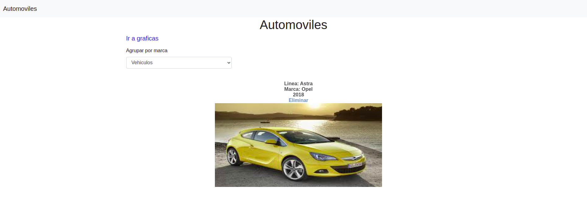
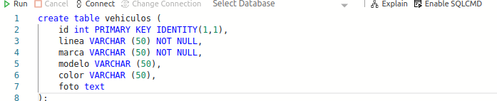
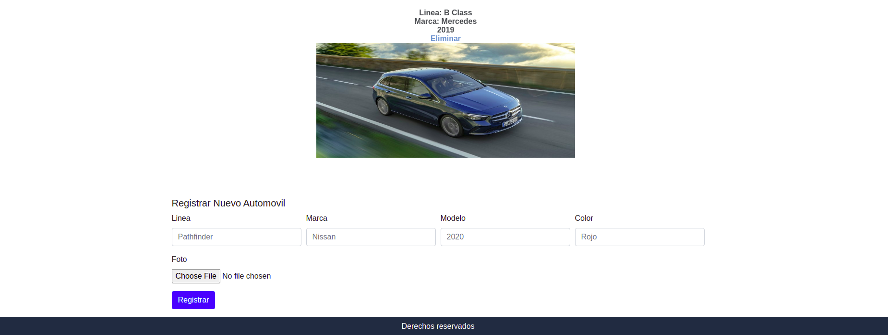

# ReactNodeExpressVehiculos

Este es un proyecto full-stack de registro de automoviles, utilizando React, Redux, CSS3 y Bootstrap en el frontend, y para el backend, Node, Express y SQLServer.

### Prerequisitos
- npm 6.14.7
- node 14.8.0

### Setup

#### Backend
- Correr $npm install    en el directorio raiz  para instalar todas las dependencias de el package.json 
- Corra en backend en la: $npm start
- El backend iniciará en el pruerto 5000, podrá ser visto en el terminal.

Crear la base de datos llamada carros SQLServer y luego crear la tabla ejecutando en Azure Data studio:

create table vehiculos (
    id int PRIMARY KEY IDENTITY(1,1),
    linea VARCHAR (50) NOT NULL,
    marca VARCHAR (50) NOT NULL,
    modelo VARCHAR (50),
    color VARCHAR (50),
    foto text
);

- En el archivo backend/server.js, cambiar las credenciales de usuario en const config.

### Frontend
- Entre al folder frontend en el terminal por medio de cd frontend
- Una vez dentro del folder corra $npm install
- Seguido de $npm start
- La apliación abrirá en el navegador en el puerto 3000

### Registrar nuevo vehiculo

- En la parte final de la pantalla pueden agregarse nuevos vehiculos.

## Construido con

- React 16.13.1
- Redux 4.0.5
- React-Bootstrap 1.0.1
- Bootstrap 4.5.0
- Visual Code

## Autor:
👤 **Gonza Javier Mancilla**

- Github: [@gonjavi](https://github.com/gonjavi)
- Linkedin: [@g-javier-mancilla](https://www.linkedin.com/in/g-mancillla)

## 🤝 Contributing

Contribuciones, problemas y solicitud de caracteristicas son bienvenidas!

## Muestra tu apoyo

Da una ⭐️ si te gusta el proyecto!

## 📝 Licencia

Este proyecto tiene licencia [MIT](lic.url).
